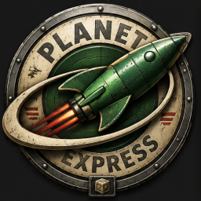
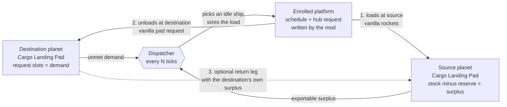
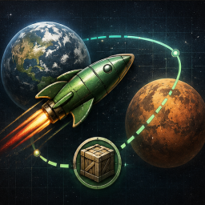

<p align="center">
  
</p>

<p align="center">
  <a href="https://mods.factorio.com/mod/planet-express"></a>
  
  <a href="LICENSE"></a>
</p>

# Planet Express — Interplanetary Merchant Fleet

A **Factorio: Space Age** mod that turns your own cargo space platforms into a
self-running merchant fleet. It automates the tedious half of interplanetary
logistics — schedule juggling and per-stop cargo requests — without ever
spawning, destroying, or teleporting anything.

The mod only **writes platform schedules**. Real ships physically fly between
planets and real rockets do the lifting. A planet can't export without actual
rockets, fuel, and goods — the physics stay honest.

## What it does

A planet's **Cargo Landing Pad** declares what stock it wants to maintain, using
its own _native_ request slots. A timer-based dispatcher then:

1. scans every other planet for **surplus** (stock above a per-item reserve),
2. picks an **idle, enrolled** cargo platform that serves both planets,
3. writes a two-planet route (`Source → Destination → back`),
4. sets the ship's per-stop cargo request sized to the surplus.

Vanilla rockets launch the goods up at the source; vanilla landing-pad requests
pull them down at the destination. The mod adds **no new entities or recipes** —
just a reserve config, a dispatcher, two GUIs, a technology, and settings.



**Two-way trade** emerges automatically: if the destination has surplus the
source needs, a return leg is added on the same two planets (toggleable).

**Re-export works for free:** surplus is `stock − reserve` regardless of whether
the planet _produces_ the item or merely _received_ it, so trade-hub/middleman
strategies just work. The one guard that keeps this safe — a planet is never a
source for an item it currently has open (unmet) demand for — prevents importing
and exporting the same item at once.

## Getting started

1.  **Research
   "Interplanetary Trade Logistics."** A mid-game technology
   (requires space platforms and produces in orbit). It gates the Trade tab and
   ship enrollment.
2. **Enroll ships.** Open a space platform's hub and, in the **Fleet** panel that
   appears beside it, flip its enrollment toggle. Tick "reserve for manual use"
   to keep an enrolled ship out of auto-dispatch when you want to fly it yourself.
3. **Set demand.** Use the landing pad's normal request slots — that _is_ the
   demand signal. Each slot gets a `source via fleet` toggle (default on) and an
   optional priority in the Trade tab. Optionally pin a **Preferred ship** for a
   planet from the Trade tab's drop-down (default "(auto)"); the dispatcher uses
   that enrolled ship when it's free and eligible, falling back to auto-pick
   otherwise.
4. **Set reserves.** In the Trade tab, set a global default floor plus per-item
   overrides so exports never strip-mine a planet below what it needs.
5. **(Optional) Gate on your own readiness.** In the Fleet tab, tick "Hold until
   ready signal" to keep a ship docked until the hub reads
   `planet-express-ready > 0`. Build whatever readiness logic you like in your own
   combinators (fuel, ammo, asteroid stock, …) and emit that one virtual signal to
   the hub. The gate only blocks dispatch — it never recalls a ship in flight.
6. **Watch it run.** Open the fleet **Monitor** from the top-bar shortcut.

## Reserve config

Reserves are the only export control knob, configured per planet in the Trade
tab:

- **Default floor** — keep at least N of everything before exporting.
- **Per-item override** — a specific floor for one item (an override of `0`
  explicitly allows exporting all of it).

Surplus offered for export = `max(0, stock − reserve)`, further suppressed below
the **minimum-trip threshold** so trivially small amounts don't dispatch ships.

## The Monitoring panel

Opened from the 
top-bar shortcut — which itself always shows live working / idle / stuck counts, and
turns red when something is stuck. Clicking it opens the full panel:

- **Fleet roster** — one row per ship: live state (idle / in transit / loading /
  unloading / withdrawn / stuck), the job as `From → To`, **the cargo it is
  carrying on that leg** as item icons, and a live **ETA** for in-flight ships.
  Loading and unloading are derived from where the ship is actually parked, so a
  trip is tracked in real time. A **stuck** ship's label carries a tooltip naming
  the cause — out of thruster fuel, no route, paused, a wait condition that never
  cleared, or held by the ready signal.
- **Planets** — one collapsible row per planet, covering both directions:
  what is `delivering` / `loading` / `waiting` inbound (a waiting item names its
  blocker: `no source`, `source busy importing`, `no ship`, `below min-trip`),
  what is `exporting` out and where to, and the `spare` stock the planet could
  still ship. Planets that only export, or only hold spare stock, appear too.
- **Alerts** — stranded / destroyed / player-edit events.

Click a ship to recenter the view on its platform. The panel refreshes on the
dispatcher timer, not every tick; in-flight ETAs tick down once a second.

## Settings (runtime-global, all synced in multiplayer)

| Setting | Default | Meaning |
| --- | --- | --- |
| Dispatch interval | 300 ticks | How often the dispatcher runs. |
| Minimum trip | 1 | Surplus below this reports as zero (no tiny trips). |
| Default reserve floor | 0 | Reserve applied to new trade nodes. |
| Max ships (global) | 0 (unlimited) | Cap on concurrent active assignments. |
| Max ships (per route) | 5 | Cap on concurrent ships per source→dest pair. |
| Two-way return trade | on | Add a reciprocal return leg when profitable. |
| Minimum load | 80% | Hold a ship until its hold is at least this full before dispatch (0 = ship any load). Perishables and otherwise-idle ships are exempt. |
| Debug log | off | Record every dispatch decision (diagnostics). |

## How it stays correct

- **Timeouts everywhere** — every wait-condition has a timeout; nothing hangs
  forever.
- **Two-sided bookkeeping** — every commitment is tracked on both the demand
  side (`inbound`) and the supply side (`committed surplus`), so nothing is
  double-claimed or double-dispatched.
- **The player always wins** — manually editing a ship's schedule withdraws it
  from the fleet (the mod won't fight you); reserving a ship for manual use
  excludes it from dispatch.
- **Re-clamp on arrival** — when a ship reaches the source, its request is
  lowered to the _current_ surplus so the reserve is honored even if stock
  dropped since dispatch.
- **Multiplayer-deterministic** — stable sorted iteration for every
  game-affecting decision, monotonic assignment ids, no unseeded randomness, all
  state in `storage`.

## Known limits / roadmap

v1 ships maintain-a-level trading on two-planet routes. Later releases added the
ready-signal dispatch gate (hold a ship until you emit `planet-express-ready`)
and **ETA-aware dispatch** — the mod now sends the ship that *delivers soonest*,
using real inter-planet distances plus a learned per-ship speed factor, and shows
a live ETA in the Monitor. Source selection stays coverage-first; ETA only
decides which ship is sent and breaks ties between equally-covering sources.
v1.8 added **fair dispatch under scarcity** — when idle ships are scarcer than
the planets needing them, the planet that has waited longest wins the next ship,
so a distant high-backlog planet is never permanently shut out by a fast, busy
short route — plus a **minimum-load gate** (the *Minimum load* setting) that
holds a ship until its hold is worthwhile, batching small requests into fuller
trips. Perishables and otherwise-idle ships are exempt, so nothing is permanently
stranded. Not yet implemented:

- **Multi-stop routes** (3–4 planets per run). Routes are already modeled
  internally as an ordered stop list, so this is a route-construction change, not
  a rewrite.
- **Deferred (out of scope):** one-shot delivery orders (v1 maintains a level
  only); extending landing-pad storage via linked pads.

## Building / packaging

Run `./package.sh` from the mod root. It derives the name and version from
`info.json`, copies only shippable entries (excluding `tests/`, `docs/`, `.git`),
and produces `planet-express_<version>.zip` ready for the mod portal.

`changelog.txt` (Factorio portal format) tracks each release; add a new
top-most entry whenever you bump the version in `info.json`.

## Development

Pure decision/view-model logic lives in plain-Lua functions over plain tables;
engine IO is isolated in thin wrappers around them. The pure math is unit-tested
with no game engine:

```
lua tests/calc_test.lua
```

Everything engine-touching (event wiring, GUIs, the tech gate, the dispatcher
loop end-to-end, the watchdog) is verified by manual in-game playtesting with the
debug decision-log on. See `CLAUDE.md` for the full conventions and `docs/` for
the design plan and API notes.

`docs/gui-notes.md` records what Factorio's GUI system can and cannot draw,
verified against the runtime API — read it before proposing interface changes.

## Feedback

Bug reports and feature requests are welcome either on the
[mod portal](https://mods.factorio.com/mod/planet-express) discussion page or as
a GitHub issue. For a bug, the most useful report says what the ships were doing
and what you expected — a save file is rarely needed.

## License

[MIT](LICENSE).
